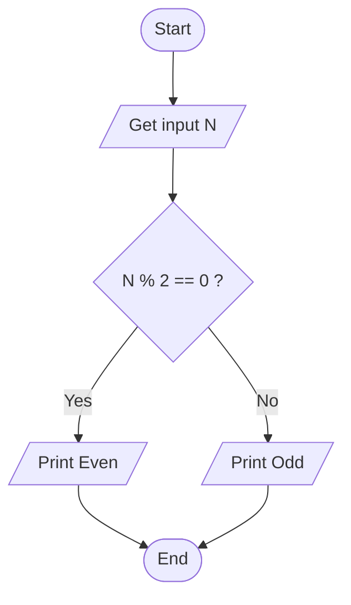
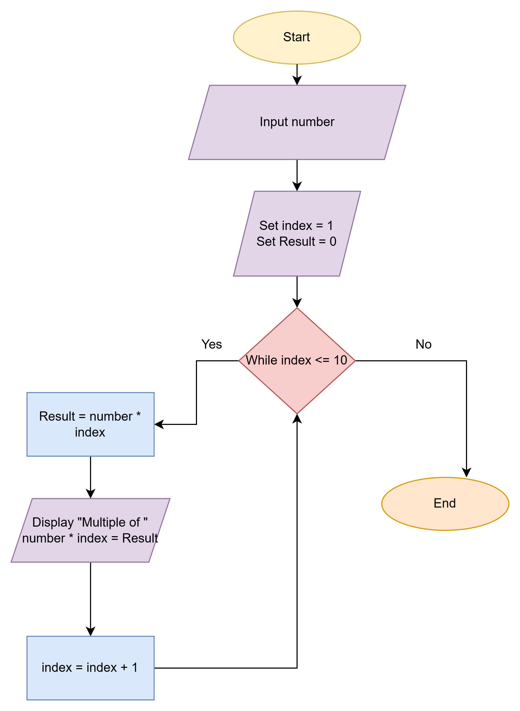
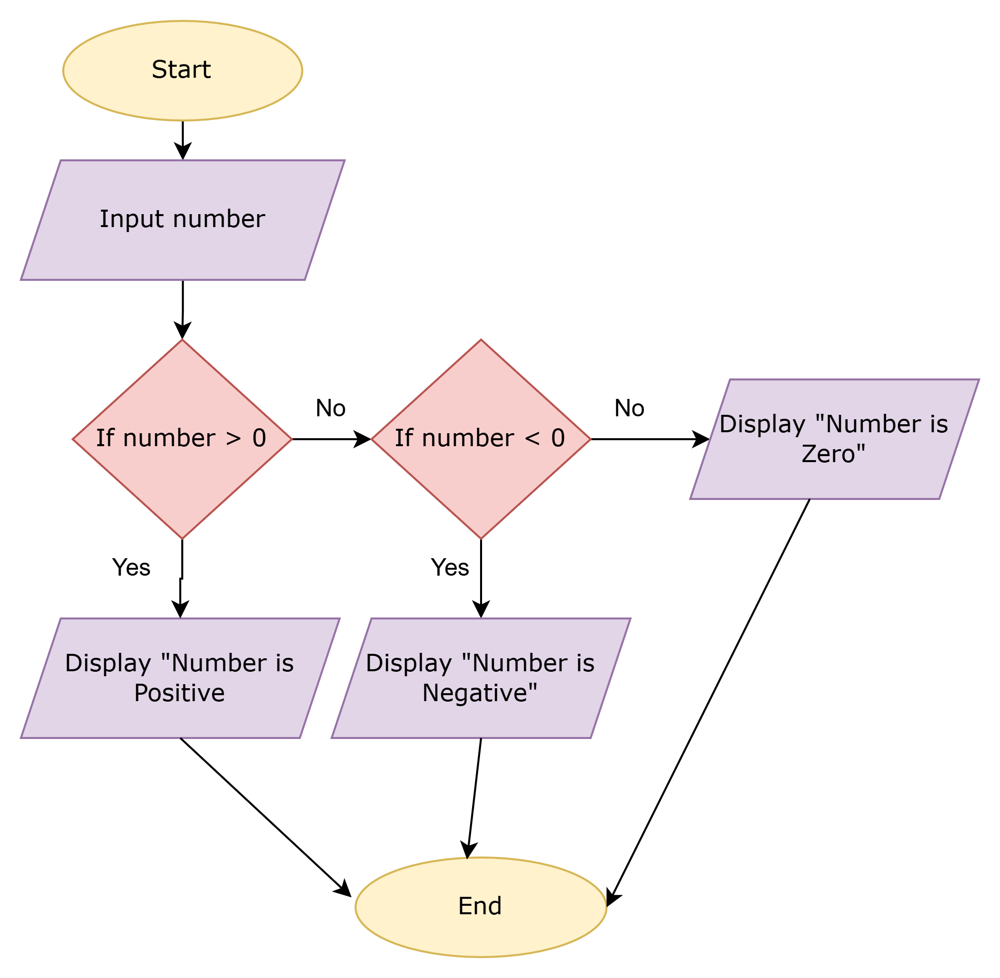
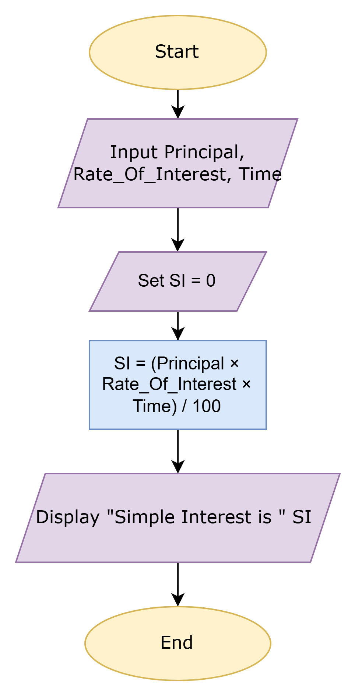
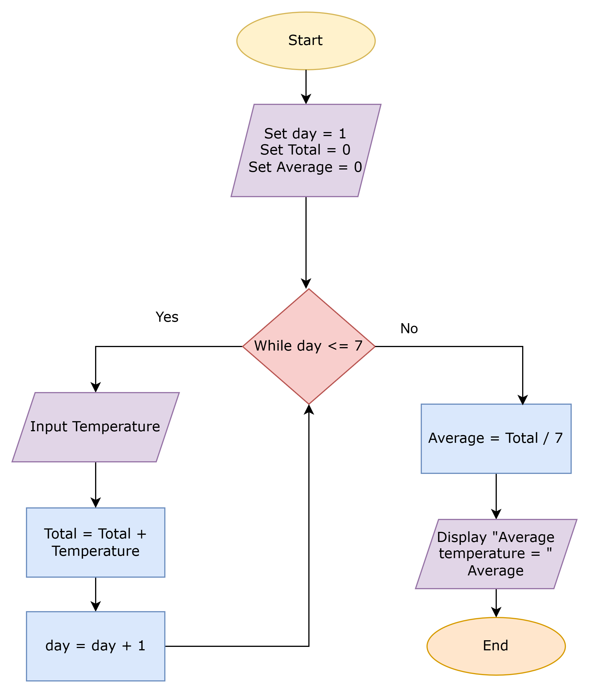
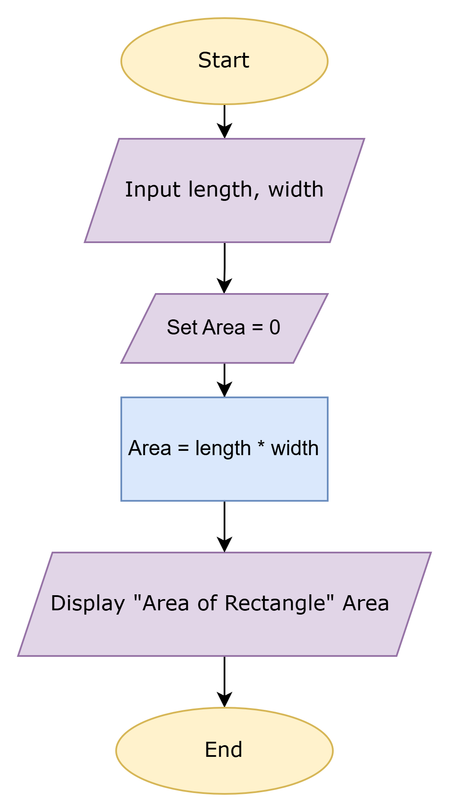
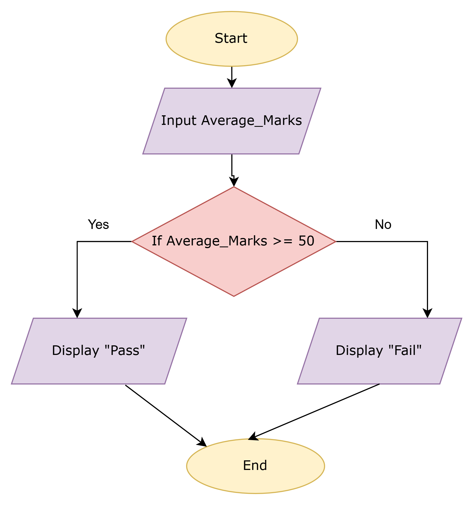
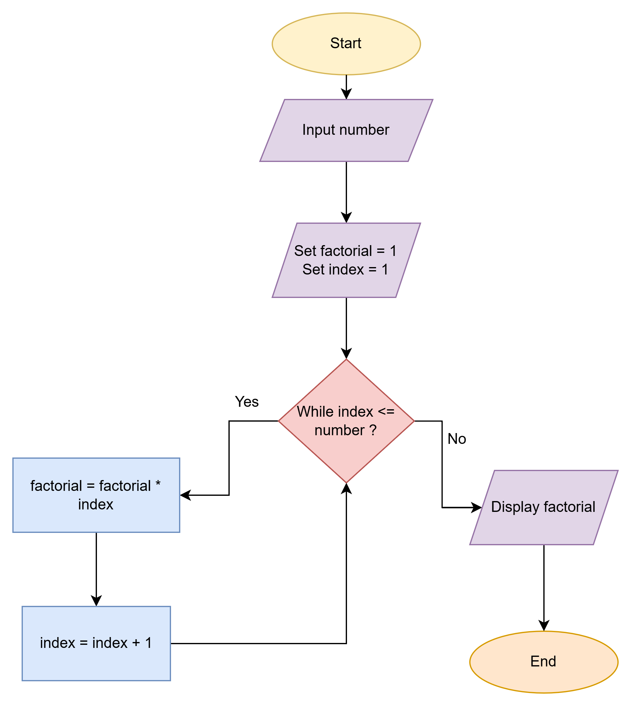

# Workshop: Algorithm and Flowchart

For each question in this workshop, you must complete **two** things:

1.  **Write the pseudocode**
2.  **Draw the flowchart** using either
    - **Option 1:** Draw.io (recommended) → export image → upload to
      your repository → link it in this file
    - **Option 2 (optional):** Write a Mermaid flowchart directly in
      Markdown
    - **Option 3 (optional):** Any other valid method

👉 **IMPORTANT:** At the **bottom of each question**, add the
following sections:

### ✔ Pseudocode

### ✔ Flowchart

---

## 1. Check Even or Odd Number

Design an algorithm and flowchart that take a number as input and
determine whether it is even or odd.

### ✔ Pseudocode

```text
START
    INPUT number
    IF number % 2 == 0 THEN
        PRINT Even
    ELSE
        PRINT Odd
    ENDIF
END
```

### ✔ Flowchart



---

## 2. Calculate Total and Average Marks

Write the algorithm and draw the flowchart for a program that inputs
marks for 3 subjects, calculates the total and average, and displays
both.

### ✔ Pseudocode

```text
START
    INPUT Subject1,Subject2,Subject3
	SET Total = 0
    SET	Average = 0
    Total = Subject1 + Subject2 + Subject3
	Average = Total / 3
	Display Total 
    Display Average 
END
```

### ✔ Flowchart


---

## 3. Display Multiplication Table

Create an algorithm and flowchart that input a number and display its
multiplication table from 1 to 10 using a loop.

### ✔ Pseudocode

```text
START
	INPUT number
	SET index = 1
	SET Result = 0
	WHILE index ≤ 10
		Result = number * index
		Display "Multiple of " number * index = Result
		index = index + 1
	END WHILE
END
```

### ✔ Flowchart




---

## 4. Positive, Negative, or Zero Check

Write the algorithm and flowchart to input a number and display whether
it is positive, negative, or zero.

### ✔ Pseudocode

```text
START
	INPUT number
	IF number > 0 THEN
		Display "Number is Positive"
	ELSE IF number < 0 THEN
		Display "Number is Negative"
	ELSE
	    Display "Number is Zero"
	END IF
END
```

### ✔ Flowchart




---

## 5. Simple Interest Calculator

Create an algorithm and flowchart for a program that calculates simple
interest using the formula:

**SI = (P × R × T) / 100**

- **P = Principal** → original amount of money
- **R = Rate of Interest** → percentage per year
- **T = Time** → number of years

### ✔ Pseudocode

```text
START
	INPUT Principal
	INPUT Rate_Of_Interest
	INPUT Time
	SET SI = 0
    SI = (Principal × Rate_Of_Interest × Time) / 100
    Display "Simple Interest is " SI 
END
```

### ✔ Flowchart




---

## 6. Average Temperature Calculation

Write the algorithm and draw the flowchart for a program that takes the
temperature of 7 days, finds the average temperature, and displays it.

### ✔ Pseudocode

```text
START
	SET day = 1
	SET Total = 0
	WHILE day <= 7
		Input Temperature
		Total = Total + Temperature
		day = day + 1
	END WHILE
	SET Average = Total / 7
	Display "Average temperature = " Average
END
```

### ✔ Flowchart




---

## 7. Calculate Area of a Rectangle

Create an algorithm and flowchart to input length and width, calculate
the area (**Area = Length × Width**), and display the result.

### ✔ Pseudocode

```text
START
	INPUT length
	INPUT width
	SET Area = 0
    Area = length * width
    Display Area 
END
```

### ✔ Flowchart




---

## 8. Determine Pass or Fail

Write the algorithm and draw the flowchart for a program that takes a
student's average marks and displays **"Pass"** if average ≥ 50,
otherwise **"Fail"**.

### ✔ Pseudocode

```text
START
	INPUT Average
	IF Average >= 50 THEN
		Display "Pass"
	ELSE
	    Display "Fail"
	END IF
END
```

### ✔ Flowchart




---

## 9. Calculate Factorial of a Number

Write the algorithm and draw the flowchart that input a number and
calculate its factorial using a loop.

### ✔ Pseudocode

```text
START
    INPUT number
    SET factorial = 1
	SET index = 1
    WHILE index <= number
        factorial = factorial * index
		index = index + 1
    END WHILE
    Display factorial
END
```

### ✔ Flowchart




---

## 10. Calculate Discount on Purchase

Write the algorithm and draw the flowchart for a program that inputs the
purchase amount and gives a **10% discount** if the amount is greater
than 1000.

### ✔ Pseudocode

```text

```

### ✔ Flowchart


---
